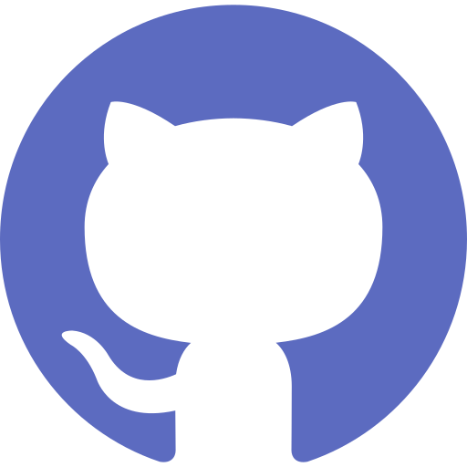

<!--  -->

<h1 align="center"> Hi there 👋, I'm Gaikawade Mahesh </h1>
<h3 align="center"> A passionate backend developer from India </h3>
<!--  -->

- 🔭 I’m currently working on **Backend Projects in Function Up**
- 🌱 I’m currently learning **MERN Stack**
- 💬 Ask me about **JavaScript, Node.JS, MongoDB**
- 📫 How to reach me: **gmhs6199@gmail.com**
- ⚡ Fun fact: **Funcky...**

<h3 align = 'left'>Languages and Tools:</h3>

    
    
    
    
    
    
    

<h3 align='left'>Connect with me:  </h3>

    
    
    
    

    
    
    

